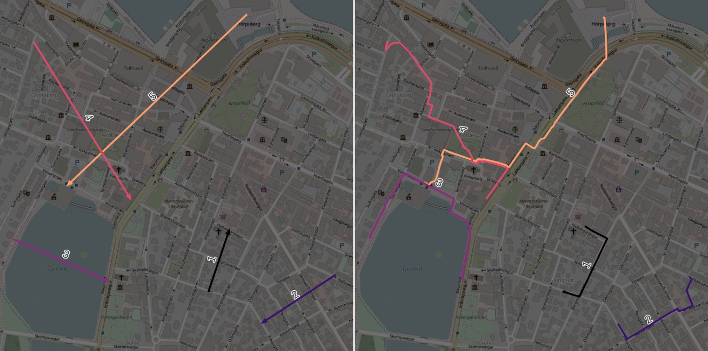

# Erde: GIS Library for Hikers

Erde is like hiking: it should allow you start quickly, yet process very large datasets on a personal computer, without need for database servers or large-RAM machines.

Making GIS processing apps with Erde takes minimum boilerplate.

Erde also contains tools for repetitive tasks:

* operations requiring spatial joins
* calculating metric length, area, or building metric buffers
* OSRM-based routing for large datasets

## Features

### Easy CLI scripts

This code creates an app that opens and saves files for you, converts types of parameters and makes help file. No more argparse hell!

	from erde import autocli
	from geopandas import GeoDataFrame as GDF

	@autocli
	def main(input_data: GDF, sample_size:float) -> GDF:
		return input_data.sample(sample_size)

call `python myscript.py` to see CLI arguments.

See [the example](examples/2_minimal_cli_app/) for more code and instructions.

### Routing

* `erde route` takes a file with lines, treats them like waypoints, and outputs a file with original attributes, route geometries, and metadata: distance, duration, nodes.

		erde route input.gpkg car route_geoms.gpkg

Example datasets: input and output:

* `erde table` takes 2 datasets of N & M points and calculates all N\*M durations/distances between them.

		erde table houses.csv shops.csv car distance-matrix.gpkg

* `erde isochrone`  takes N points and m travel durations, and get N\*m isochrones in 1 line

Examples: from command line:

	$ erde isochrone my_houses.gpkg foot 5,10,15 my_isochrones.gpkg

from code/Jupyter:

	from erde import isochrone
	areas_df = isochrone(houses_df, 'foot', [5, 10, 15])

### GIS-specific tools

* shortcuts for common usecases of sjoin: lookup, aggregate by geometry, and filter by geometry
* area/length/buffer in metres, all cleanup done under the hood
* CRS conversion

### Code organization

* **chunk processing:** process large datasets in chunks, but still as dataframes, with @autocli or own code
* **@autocli decorator** turns a function into a GIS-aware CLI app (without argparse pain)

