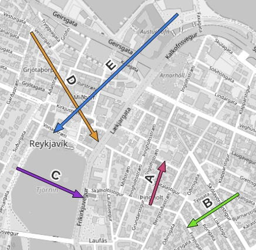
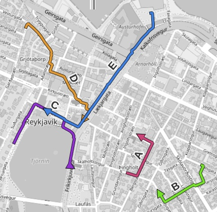

# Routing

This is an example of `route` method usage. See [the notebook](./Routing%20Examples.ipynb) for interactive examples.

Please, do not use openstreetmap.de routers for mass routing, they're a non-commercial demo. Get a [Docker image](https://hub.docker.com/u/osrm/) and run your own local OSRM, this will give you much higher performance.

Sample of input CSV:

	WKT,rid,name
	"LINESTRING (-21.9348912 64.1440043,-21.9338223 64.1453913)","1","A"
	"LINESTRING (-21.9285042 64.1443567,-21.9322321 64.1432880)","2","B"

On map:

Every LineString is treated as a sequence of points: start poirt, (number of waypoints), destination.

Run this command to see the script working:

	$ erde route reykjavik-directions.csv https://routing.openstreetmap.de/routed-foot routes.geojson

(Input and output formats can be any: CSV, GeoJSON, GPKG, Shape.)

Resulting routes on map:

In the result file, the attributes of input are preserved, the geometry is replaced with the best route geometry, and 3 more added: `alternative`, `distance`, `duration`.

	"features": [
	{
		"type": "Feature",
		"properties": {
			"rid": 1,
			"name": "A",
			"alternative": 1,
			"duration": 202.3,
			"distance": 252.8
		},
		"geometry": {
			"type": "LineString",
			"coordinates": [ [ -21.93487, 64.14403 ], [ -21.93406, 64.14392 ]

To get more than 1 route for a direction, set `--alternatives` option. Every row from input will be then duplicated in the output.

## Imported Function

Script [imported_route.py](./imported_route.py) calls routing and then takes the geometries to calculate some more values, but does not save the routing linestrings directly.

Usage:

	$ python3 imported_route.py reykjavik-directions.csv length-ratio.csv

A sample from output data (formatting and precision modified for readability):

	rid,name,geometry,length,routed_length,extra_travel_ratio
	1,A,"LINESTRING (-21.934891 64.144004, -21.933822
		64.145391)",162.886,252.724,1.551
	2,B,"LINESTRING (-21.928504 64.144356, -21.932232
		64.143287)",216.581,315.256,1.455
