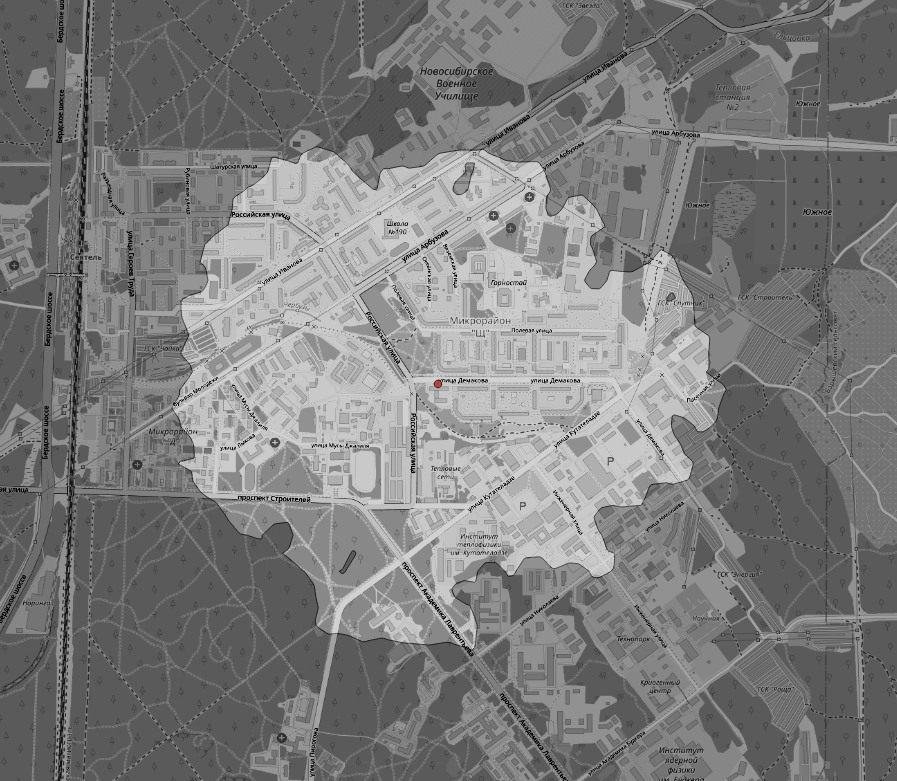
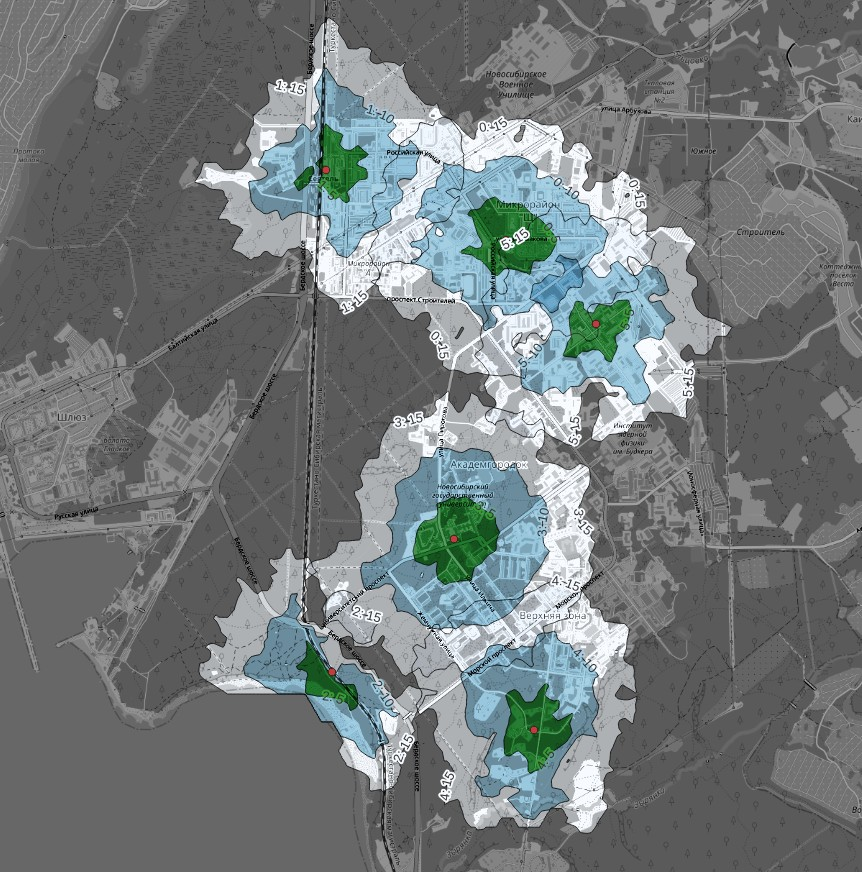

# Isochrones

## Prerequisites

This tutorial requires [QGIS](https://qgis.org/) to visualise geospatial files. In QGIS you should also install QuickMapServices (QMS) plugin to see tiled background layers.

Isochrones module uses [OSRM table requests](https://github.com/Project-OSRM/osrm-backend/blob/master/docs/http.md#table-service). Demo servers do not have this feature, so you'll have to set up your own server. Follow [this instruction](../local-osrm.md) to set it up.

## Hello, World Demo

With a local server running, you can go to this folder on local drive and run from command line:

    erde isochrone one-source.csv local 15 5 one-isochrone.gpkg

Run the command, then add the new `one-isochrone.gpkg` file as a layer to QGIS. Or, after the .gpkg file has been created, open [`example.qgz`](./example1.qgz) with QGIS. The map should look like this:

## More Sophisticated Demo

Let's replace the parameters for the command-line script:

* `one-source.csv` => `sources.csv`: use multiple isochrones source instead of one.
* `local`: name of router in erde config, will remain the same.
* `15` => `5,10,15`: instead of one polygon, let's make several for each isochrone.
* `5`: we assume pedestrian speed is 5 km/h. Modifying this parameter won't change isochrone areas. It works only to limit or expand the area where the polygon is built. Setting it very low will crop the polygons. Setting it very high will generate large grids of points (quadratically, e.g. double speed = quadruple grid) and slow down the calculations.
* `one-isochrone.gpkg` => `isochrones.gpkg`: file to write the isochrone(s) to. 

The command should look like this:

    erde isochrone sources.csv local 5,10,15 5 isochrones.gpkg

Result `isochrones.gpkg` on map:

You can open QGIS project [`example2.qgz`](./example2.qgz) with these styles.
