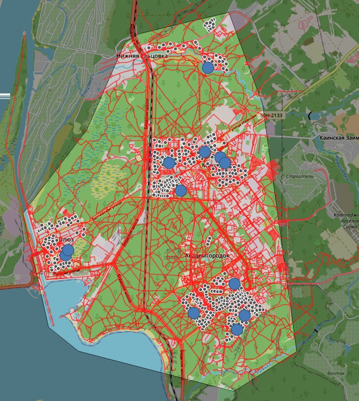
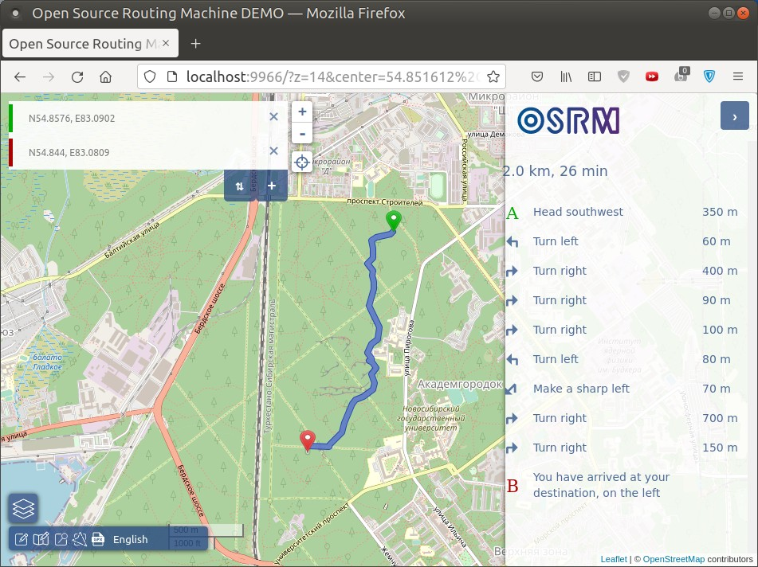

# Local OSRM Server Setup

Since OpenStreetMap.de demo servers don't support table requests, we have to set up own server with Docker. Newest images are [available on DockerHub](https://hub.docker.com/r/osrm/osrm-backend/tags?page=1&ordering=last_updated). We'll use image v5.25.

**Setup:** get [Docker Engine](https://docs.docker.com/engine/install/) and [Compose](https://docs.docker.com/compose/install/).

The [compose file](./docker-compose.yml) has everything necessary. In [`osrm`](./osrm) folder, there's [`foot.osm.pbf`](./osrm/foot.osm.pbf) file with a local area, used in examples 6 and 7:

(To make your own area, [download an osm.pbf file](https://wiki.openstreetmap.org/wiki/Planet.osm#Country_and_area_extracts) and put it into `osrm` folder, rename as `foot.osm.pbf`.)

**Building**

Run the following containers:

    docker-compose up extract
    docker-compose up partition
    docker-compose up customize
    docker-compose up backend frontend

If all steps succeed, you can open frontend at http://localhost:9966/ and try building routes. Notice: the included `.osm.pbf` file contains only small area near the houses and the schools in the dataset:

Building a [test route](http://localhost:9966/?z=14&center=54.851636%2C83.088655&loc=54.857640%2C83.090200&loc=54.844026%2C83.080888&hl=en&alt=0):

As expected, the route goes along paths and footways.
